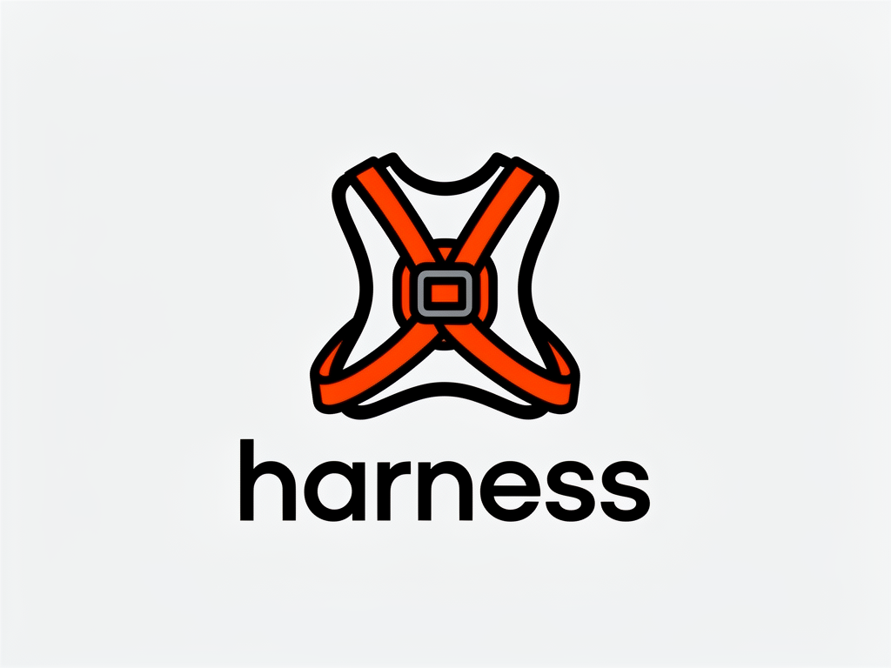

<p align="center" style="margin-bottom: 0">
  
</p>

Easily spin up a sandboxed agent within a directory. Supports multiple coding agent backends: [`pi`](https://pi.dev/) (default), [`opencode`](https://opencode.ai), and [`hermes`](https://github.com/NousResearch/hermes-agent).

## Prerequisites

[Docker](https://www.docker.com) is required to run the container.

By default, harness uses a local model via [LM Studio](https://lmstudio.ai). Start the daemon and pull the default model:

```bash
lms daemon up
lms get google/gemma-4-e4b
```

The container is preconfigured to use `gemma-4-e4b` via LM Studio's local API.

### Using a cloud provider instead

#### pi (default agent)

If you pass an API key for a supported provider via `--env-file`, [`pi`](https://pi.dev/) will use that provider instead of the local LM Studio setup. Supported keys:

| Provider | Environment Variable |
|----------|----------------------|
| Anthropic | `ANTHROPIC_API_KEY` |
| OpenRouter | `OPENROUTER_API_KEY` |
| OpenAI | `OPENAI_API_KEY` |
| Google Gemini | `GEMINI_API_KEY` |
| Mistral | `MISTRAL_API_KEY` |
| Groq | `GROQ_API_KEY` |
| Cerebras | `CEREBRAS_API_KEY` |
| xAI | `XAI_API_KEY` |
| Hugging Face | `HF_TOKEN` |

See the [full list of supported providers](https://github.com/badlogic/pi-mono/blob/c779c14e91bc2ea65143e59b0dc1baf3646ba8c9/packages/coding-agent/docs/providers.md#api-keys) for more options. When using LM Studio locally, 16k context is sufficient.

#### opencode agent

[`opencode`](https://opencode.ai) uses LM Studio by default. To use OpenRouter instead, pass an env file containing `OPENROUTER_API_KEY`:

```bash
npx @capotej/harness -a opencode -e .env -p "refactor the auth module"
```

The model is automatically selected based on the provider (`openrouter/auto` for OpenRouter, `google/gemma-4-e4b` via LM Studio). Override with `-m`. When using LM Studio locally, ensure the model's context length is set to at least 32k tokens.

```bash
# Use a specific OpenRouter model
npx @capotej/harness -a opencode -e .env -m anthropic/claude-sonnet-4-5 -p "add tests"
```

#### hermes agent

[`hermes`](https://github.com/NousResearch/hermes-agent) by NousResearch supports many providers. Pass an env file with your API key:

```bash
npx @capotej/harness -a hermes -e .env -p "refactor the auth module"
```

Specify a model using `provider/model` format:

```bash
npx @capotej/harness -a hermes -e .env -m "anthropic/claude-sonnet-4-5" -p "add tests"
npx @capotej/harness -a hermes -e .env -m "openrouter/auto" -p "add tests"
```

Supported provider env vars include `ANTHROPIC_API_KEY`, `OPENROUTER_API_KEY`, `OPENAI_API_KEY`, `GOOGLE_API_KEY`, and [many others](https://github.com/NousResearch/hermes-agent/blob/main/.env.example).

When using LM Studio locally, ensure the model's context length is set to at least 64k tokens.

## Usage

Navigate to any project directory and run:

```bash
# Run the agent with a prompt
npx @capotej/harness -p "write me a fizzbuzz in Go"

# Pipe a prompt via stdin
echo "write me a fizzbuzz in Go" | npx @capotej/harness

# Pass an env file (e.g. for API keys)
npx @capotej/harness -e .env

# Combine flags
npx @capotej/harness -e .env -p "add a login endpoint"

# Use a specific model
npx @capotej/harness -m anthropic/claude-sonnet-4-5 -p "refactor the auth module"

# Mount a single file instead of the current directory
npx @capotej/harness -f ./script.py -p "add type hints"

# Use the opencode agent
npx @capotej/harness -a opencode -p "write me a fizzbuzz in Go"

# Use opencode with OpenRouter
npx @capotej/harness -a opencode -e .env -p "write me a fizzbuzz in Go"
```

This will start a container from the `capotej/harness` image, mount your current directory as `/workspace` inside the container, and run the selected coding agent.

### Image verification

By default, harness verifies that the container image was signed by the official CI workflow and includes a valid SLSA provenance attestation. This requires [cosign](https://github.com/sigstore/cosign) (`brew install cosign`). If cosign is not installed, harness exits with an error. Pass `--no-verify` to skip verification:

```bash
npx @capotej/harness --no-verify -p "write me a fizzbuzz in Go"
```

### Dependency cooldown

Harness enforces a 1-week cooldown on dependency resolution inside the container. When an agent runs `pnpm install` or `uv pip install`, any package published within the last 7 days is rejected. This mitigates supply-chain attacks on freshly published packages, which are typically discovered and yanked within hours.

- **pnpm**: `minimumReleaseAge=10080` (10080 minutes = 7 days) via `.npmrc`
- **uv**: `--exclude-newer` set to 7 days ago (computed at image build time) passed to `uv pip install`

The cooldown applies to all dependency resolution, including transitive dependencies. Agents can still install packages that are older than the cooldown window.

### Persistence

For interactive runs (no `-p` and no piped stdin), harness creates a `.harness/<agent>/` directory in your working directory and bind-mounts it into the container. This lets agents resume sessions, skip database migrations on repeat runs, and retain memories across invocations.

One-shot runs (`-p "..."` or piped stdin) are implicitly ephemeral — no `.harness/` directory is created. Use `--ephemeral` to force-disable persistence for interactive runs.

Add `.harness/` to your `.gitignore` to avoid committing agent state to your repository.

You can also install globally and use the `harness` command directly:

```bash
npm install -g @capotej/harness
# or
pnpm add -g @capotej/harness
# or
bun add -g @capotej/harness
```

All examples use `npx`, but `bunx` and `pnpm dlx` work as drop-in replacements:

```bash
bunx @capotej/harness -p "write me a fizzbuzz in Go"
pnpm dlx @capotej/harness -p "write me a fizzbuzz in Go"
```

## Options

| Flag | Alias | Description |
|------|-------|-------------|
| `--prompt` | `-p` | Pass a prompt directly to the coding agent |
| `--env-file` | `-e` | Load environment variables from a file into the container |
| `--file` | `-f` | Mount a single file into the container instead of the current directory |
| `--model` | `-m` | Override the model used by the agent |
| `--agent` | `-a` | Select the coding agent (`pi`, `opencode`, or `hermes`, default: `pi`) |
| `--no-verify` | | Skip cosign image signature and provenance verification |
| `--ephemeral` | | Disable session persistence (implied by `-p` and piped stdin) |

### Environment variables

| Variable | Description |
|----------|-------------|
| `HARNESS_IMAGE_TAG` | Override the Docker image tag (defaults to the current package version) |

### Agent-specific options

**`pi`** — model is passed directly as a CLI argument. Supports any provider key in the env file.

**`opencode`** — model is passed via `OPENCODE_MODEL` env var. Provider is auto-detected from the env file: if `OPENROUTER_API_KEY` is present, OpenRouter is used; otherwise LM Studio (local). The `-m` flag accepts a bare model name (e.g. `anthropic/claude-sonnet-4-5`) and the provider prefix is added automatically.

**`hermes`** — model is passed via `--model` flag using `provider/model` format (e.g. `anthropic/claude-sonnet-4-5`). Provider is auto-detected from whichever API key is present in the env file.

## Deploying hermes-agent as a "claw" on fly.io

You can deploy [`hermes`](https://github.com/NousResearch/hermes-agent) as a long-running "claw" on [fly.io](https://fly.io) so it can be reached over a messaging gateway. These instructions assume Telegram, but can easily be adapted to other [messaging gateways](https://hermes-agent.nousresearch.com/docs/user-guide/messaging/).

This assumes you have the `fly` CLI installed and authenticated with your fly.io account:

```bash
brew install flyctl
fly auth login
```

Create `fly.toml`:

```toml
app = "my-hermes-agent-claw"
primary_region = "iad"

[env]
  TZ = "America/New_York"

[build]
  image = "ghcr.io/capotej/harness:hermes-1.4.5"

[processes]
  app = "hermes gateway"

[[mounts]]
  source = "my_hermes_agent_claw_data"
  destination = "/home/harness/.hermes-openrouter"
  initial_size = "1gb"

[[vm]]
  size = "shared-cpu-1x"
  memory = "512mb"

[[restart]]
  policy = "always"
  max_retries = 3
```

Then create the app, volume, and secrets, and deploy:

```bash
fly apps create my-hermes-agent-claw
fly volumes create my_hermes_agent_claw_data --region iad --size 1 --app my-hermes-agent-claw
fly secrets set OPENROUTER_API_KEY=<your-key> --app my-hermes-agent-claw
# See https://hermes-agent.nousresearch.com/docs/user-guide/messaging/telegram#option-b-manual-configuration
fly secrets set TELEGRAM_BOT_TOKEN=<your-token> --app my-hermes-agent-claw
fly secrets set TELEGRAM_ALLOWED_USERS=<your-user-ids> --app my-hermes-agent-claw
fly secrets set GH_TOKEN=<your-personal-access-token> --app my-hermes-agent-claw
fly deploy --app my-hermes-agent-claw
```

> **GitHub CLI access:** The `GH_TOKEN` secret makes the `gh` CLI available inside the container. Tell the agent to add `terminal.env_passthrough: [GH_TOKEN]` to its `config.yaml` so the token is accessible in the sandbox.

### Using your hermes-agent

Message the bot directly via Telegram, or wire it up to a scheduled workflow — see the [daily briefing bot guide](https://hermes-agent.nousresearch.com/docs/guides/daily-briefing-bot) for an example.

## Developing

```bash
pnpm link --global
```

This makes the `harness` command available globally from your local checkout. To remove it:

```bash
pnpm unlink --global @capotej/harness
```

### Linting

```bash
pnpm lint        # run all linters
pnpm lint:ts     # Biome (TypeScript + JSON)
pnpm lint:md     # markdownlint
pnpm lint:sh     # shellcheck
pnpm lint:docker # hadolint
pnpm lint:actions # actionlint
pnpm format      # auto-format with Biome
```

`shellcheck`, `hadolint`, and `actionlint` are system binaries — install them locally before running the shell/Docker/Actions sub-linters:

```bash
brew install shellcheck hadolint actionlint
```

## Building

```bash
make image
```

Builds the `capotej/harness` Docker image with:

- Debian stable-slim
- Node.js v24
- [`@mariozechner/pi-coding-agent`](https://pi.dev/) globally installed via pnpm
- [`opencode-ai`](https://opencode.ai) globally installed via pnpm
- [`hermes-agent`](https://github.com/NousResearch/hermes-agent) installed via uv + Python 3
- `fd`, `ripgrep`, `jq`, `curl`

### Base image pinning

The `Dockerfile` pins the base image by digest rather than tag to ensure reproducible builds. The digest used is the **manifest list** (OCI image index), not a per-platform manifest. This is important for multi-arch support: a manifest list digest resolves to the correct platform-specific image at build time, whereas pinning a per-platform digest causes a platform mismatch warning when building on a different architecture.

To update the base image, fetch the manifest list digest and update `Dockerfile`:

```bash
docker buildx imagetools inspect debian:stable-slim --format '{{.Manifest.Digest}}'
```
